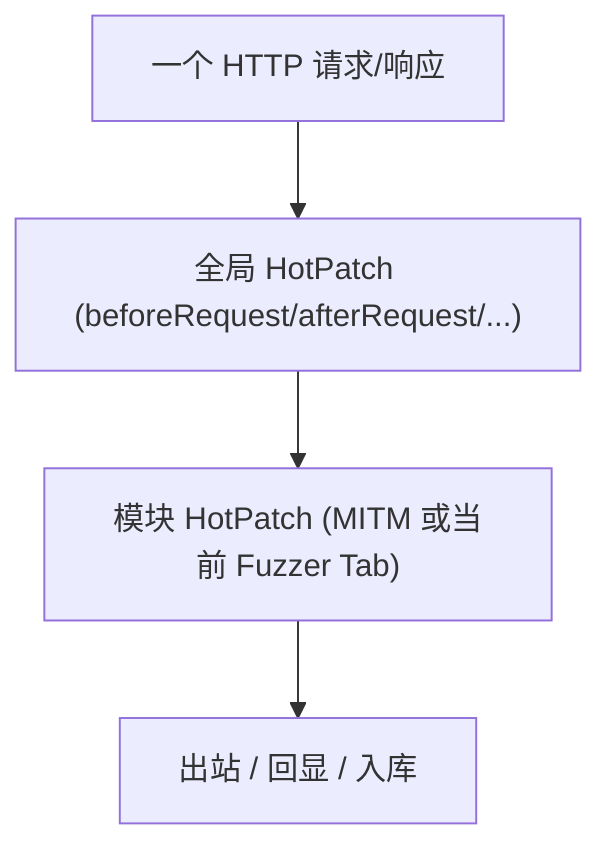
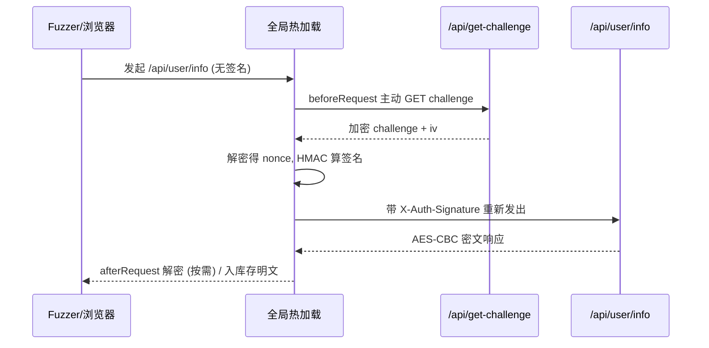

# SKILL: Yakit 全局热加载 (Global Hot Patch)

> AI LOAD INSTRUCTION: 这是三层热加载体系中的"全局层"。全局热加载是 MITM 与 Web Fuzzer 共享的全系统级 hook，执行顺序为 `全局 HotPatch -> 模块 HotPatch`，同时只能启用 1 个。它最适合做"协议归一化"——一处定义全站加解密/签名/染色，MITM 和所有 Fuzzer Tab 自动生效。先读全局 vs 模块对比，再看 `example-*.yak`。

## 0. 相关路由

- 总入口与三层体系：[yak](../yak/SKILL.md)
- 模块级 MITM 热加载：[mitm-hotpatch](../mitm-hotpatch/SKILL.md)
- 模块级 Web Fuzzer 热加载：[webfuzzer-hotpatch](../webfuzzer-hotpatch/SKILL.md)

## 1. 全局 vs 模块

| 维度 | 全局热加载 | 模块（MITM / Fuzzer）热加载 |
|---|---|---|
| 入口 | 配置管理 → 全局模板 | MITM 配置 / Fuzzer Hot Patch 窗口 |
| 作用范围 | 全系统所有 MITM/Fuzzer 流量 | 仅当前 MITM 任务或 Fuzzer Tab |
| 执行顺序 | **先于** 模块 hook 执行 | 后于全局 hook 执行 |
| 启用数量 | 同时只能启用 1 个 | 每个 MITM/Tab 独立 |
| 适合场景 | 协议归一化、统一签名、全站染色、危险操作护栏 | 单任务/单接口的特化处理 |



## 2. 可用 Hook

全局热加载复用与 MITM/Fuzzer 相同名字的 hook（按需定义）：

- `beforeRequest(isHttps, originReq, req) -> req`：全站请求出站前改写（加密/签名/补头）。
- `afterRequest(isHttps, originReq, req, originRsp, rsp) -> rsp`：全站响应回显前改写（解密）。
- `hijackHTTPRequest(isHttps, url, req, forward, drop)`：全站请求劫持。
- `hijackSaveHTTPFlow(flow, modify, drop)`：全站入库改写（染色/脱敏/存明文）。
- `mockHTTPRequest(isHttps, url, req, mockResponse)`：全站危险操作护栏。

## 3. 实战场景

| 场景 | Hook 组合 | 示例 |
|---|---|---|
| 全站 SM4-CBC 透明加解密 + 入库存明文 | `beforeRequest` + `afterRequest` + `hijackSaveHTTPFlow` | [example-global-sm4-transparent.yak](example-global-sm4-transparent.yak) |
| 动态 Challenge + HMAC 签名注入 + 响应解密 | `beforeRequest` + `afterRequest` + `hijackSaveHTTPFlow` | [example-global-challenge-sign.yak](example-global-challenge-sign.yak) |
| 默认 Authorization Bearer 自动注入 | `beforeRequest` | [example-global-auto-bearer.yak](example-global-auto-bearer.yak) |
| 全站按状态码染色 + 打标签 | `hijackSaveHTTPFlow` | [example-global-flow-coloring.yak](example-global-flow-coloring.yak) |

### 重点：文章 009 的动态 challenge 链路

`example-global-challenge-sign.yak` 完整还原了公众号 009 的场景，自测用文章里给出的**真实抓包数据**离线断言：

1. `beforeRequest`：命中 `/api/user/info` 时，主动 `GET /api/get-challenge`，解密拿 nonce，HMAC 算签名，写入 `X-Auth-Signature`。
2. `afterRequest`：请求带 `X-Yak-Force-Plaintext: 1` 时把响应 AES-CBC 解成明文（避免无条件改写破坏浏览器前端解密）。
3. `hijackSaveHTTPFlow`：MITM 不动在线流量，只把入库的响应改写成明文便于分析。



## 4. 标准写法：hook 函数 + YAK_MAIN 自测

与 MITM/Fuzzer 完全一致——注册 hook，再用 `if YAK_MAIN { runSelfTest() }` 守卫。

- `yak xxx.yak`：`YAK_MAIN = true`，跑自测。
- yakit 全局热加载窗口：`YAK_MAIN = false`，仅注册 hook。

> 在线 hook（如 challenge 链路里的 `fetchChallengeSignature` 需 `poc.HTTP` 发副请求）在自测时可只验证其依赖的**纯函数**（签名计算、响应解密），避免自测依赖真实靶场。

## 5. 验证

```bash
cd /Users/v1ll4n/Projects/yaklang
go run common/yak/cmd/yak.go skills/global-hotpatch/example-global-challenge-sign.yak
```

每个示例应：10 秒内完成、assert 全过、log 全英文、出现 `... self test passed`。

## 参考来源

- yak-project-public 009 (2026-03-18) 前端加密测不动 全局热加载帮你自动接管签名流程
- yak-project-public 030 (2025-10-24) Yakit 热加载实战技巧
- yak-project-public 085 (2024-11-27) 全局配置插件环境变量
- 引擎实现：`common/yakgrpc/grpc_global_hotpatch_test.go`
