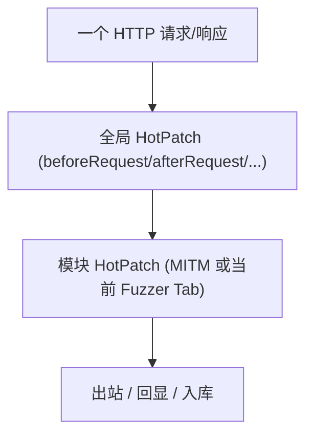
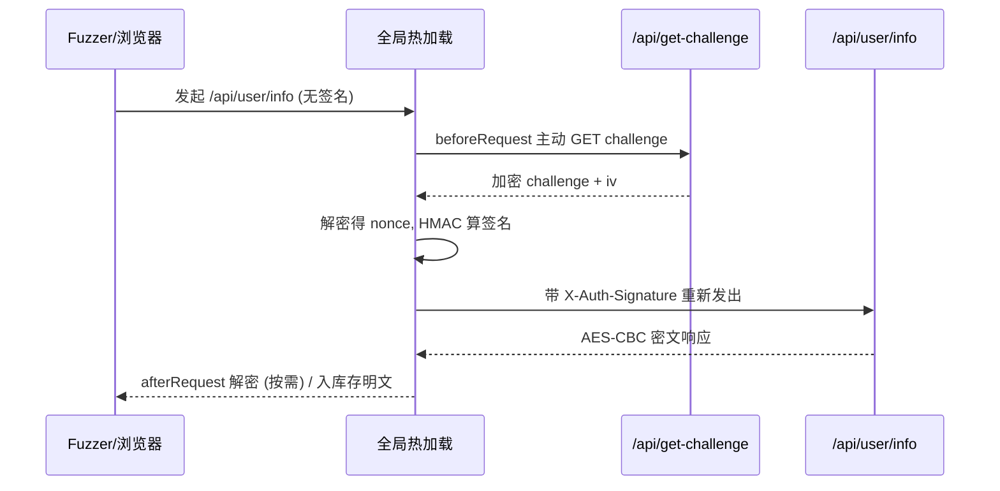

# SKILL: Yakit 全局热加载 (Global Hot Patch)

> AI LOAD INSTRUCTION: 这是三层热加载体系中的"全局层"。全局热加载是 MITM 与 Web Fuzzer 共享的全系统级 hook，执行顺序为 `全局 HotPatch -> 模块 HotPatch`，同时只能启用 1 个。它最适合做"协议归一化"——一处定义全站加解密/签名/染色，MITM 和所有 Fuzzer Tab 自动生效。先读全局 vs 模块对比，再看 `examples/` 下按 Hook 命名的示例。

## 0. 相关路由

- 总入口与三层体系：[yak](../yak/SKILL.md)
- 模块级 MITM 热加载：[mitm-hotpatch](../mitm-hotpatch/SKILL.md)
- 模块级 Web Fuzzer 热加载：[webfuzzer-hotpatch](../webfuzzer-hotpatch/SKILL.md)

## 1. 全局 vs 模块

| 维度 | 全局热加载 | 模块（MITM / Fuzzer）热加载 |
|---|---|---|
| 入口 | 配置管理 → 全局模板 | MITM 配置 / Fuzzer Hot Patch 窗口 |
| 作用范围 | 全系统所有 MITM/Fuzzer 流量 | 仅当前 MITM 任务或 Fuzzer Tab |
| 执行顺序 | **先于** 模块 hook 执行 | 后于全局 hook 执行 |
| 启用数量 | 同时只能启用 1 个 | 每个 MITM/Tab 独立 |
| 适合场景 | 协议归一化、统一签名、全站染色、危险操作护栏 | 单任务/单接口的特化处理 |



## 2. 可用 Hook（与 MITM 同一套，全局先执行）

全局热加载与 MITM 共用**同一套 `MixPluginCaller` 执行管线和 Hook 集合**（后端 `mitm_global_hotpatch_pipeline.go`：每个 hook 点先 `globalCaller` 再 `moduleCaller`）。因此 [mitm-hotpatch](../mitm-hotpatch/SKILL.md) 的 12 个 Hook 在全局层**全部可用、签名完全相同**，区别只在：全局先于模块执行、跨 MITM+Fuzzer 生效。

yakit 默认全局模板就用 `hijackHTTPRequest` + `beforeRequest` + `hijackSaveHTTPFlow` 给全站盖 `X-Yakit-Global-HotPatch` 标记。

## 3. 全部 Hook 示例索引（examples/，一个函数一个示例）

表中**每一个 Hook 都有独立的全局风格示例 + YAK_MAIN 自测**，另含 2 个真实文章复现的多 Hook 进阶示例。

| Hook | 全局示例场景 | 文件 |
|---|---|---|
| `hijackHTTPRequest` | 给所有出站请求盖全局标记 | [examples/hijack-request.yak](examples/hijack-request.yak) |
| `hijackHTTPResponse` | 给所有响应盖全局标记 | [examples/hijack-response.yak](examples/hijack-response.yak) |
| `hijackHTTPResponseEx` | 凭请求上下文有条件改写响应 | [examples/hijack-response-ex.yak](examples/hijack-response-ex.yak) |
| `beforeRequest` | 默认 Authorization Bearer 自动注入 | [examples/before-request.yak](examples/before-request.yak) |
| `afterRequest` | 全站统一响应审计标记 | [examples/after-request.yak](examples/after-request.yak) |
| `mirrorHTTPFlow` | 全站流量审计计数 | [examples/mirror-http-flow.yak](examples/mirror-http-flow.yak) |
| `mirrorFilteredHTTPFlow` | 全站过滤后流量聚焦审计 | [examples/mirror-filtered-http-flow.yak](examples/mirror-filtered-http-flow.yak) |
| `mirrorNewWebsite` | 全站资产清单 | [examples/mirror-new-website.yak](examples/mirror-new-website.yak) |
| `mirrorNewWebsitePath` | 全站路径清单 | [examples/mirror-new-website-path.yak](examples/mirror-new-website-path.yak) |
| `mirrorNewWebsitePathParams` | 全站可 Fuzz 端点清单 | [examples/mirror-new-website-path-params.yak](examples/mirror-new-website-path-params.yak) |
| `hijackSaveHTTPFlow` | 全站按状态码染色 + 打标签 | [examples/hijack-save-http-flow.yak](examples/hijack-save-http-flow.yak) |
| `mockHTTPRequest` | 全局 kill-switch 拦截黑名单域名 | [examples/mock-http-request.yak](examples/mock-http-request.yak) |

进阶（真实文章复现，多 Hook 组合）：

| 场景 | Hook 组合 | 文件 |
|---|---|---|
| 全站 SM4-CBC 透明加解密 + 入库存明文 | `beforeRequest` + `afterRequest` + `hijackSaveHTTPFlow` | [examples/advanced-sm4-transparent.yak](examples/advanced-sm4-transparent.yak) |
| 动态 Challenge + HMAC 签名注入 + 响应解密 | `beforeRequest` + `afterRequest` + `hijackSaveHTTPFlow` | [examples/advanced-challenge-sign.yak](examples/advanced-challenge-sign.yak) |

### 重点：文章 009 的动态 challenge 链路

`examples/advanced-challenge-sign.yak` 完整还原了公众号 009 的场景，自测用文章里给出的**真实抓包数据**离线断言：

1. `beforeRequest`：命中 `/api/user/info` 时，主动 `GET /api/get-challenge`，解密拿 nonce，HMAC 算签名，写入 `X-Auth-Signature`。
2. `afterRequest`：请求带 `X-Yak-Force-Plaintext: 1` 时把响应 AES-CBC 解成明文（避免无条件改写破坏浏览器前端解密）。
3. `hijackSaveHTTPFlow`：MITM 不动在线流量，只把入库的响应改写成明文便于分析。



## 4. 标准写法：hook 函数 + YAK_MAIN 自测

与 MITM/Fuzzer 完全一致——注册 hook，再用 `if YAK_MAIN { runSelfTest() }` 守卫。

- `yak xxx.yak`：`YAK_MAIN = true`，跑自测。
- yakit 全局热加载窗口：`YAK_MAIN = false`，仅注册 hook。

> 在线 hook（如 challenge 链路里的 `fetchChallengeSignature` 需 `poc.HTTP` 发副请求）在自测时可只验证其依赖的**纯函数**（签名计算、响应解密），避免自测依赖真实靶场。

> 并发与全局变量（重要）：全局热加载作用面更广、并发更高。顶层全局只放 **只读常量**（密钥/IV/规则，加载一次后不改），**绝不在 hook 里写共享可变全局**，否则多请求并发写会 data race 崩溃。跨请求聚合用 `sync.Map`/`sync.NewMutex()` 或 `db.*`/`risk.*`。详见 [webfuzzer-hotpatch 第 6 节](../webfuzzer-hotpatch/SKILL.md)。

## 5. 验证

```bash
cd /Users/v1ll4n/Projects/yaklang
go run common/yak/cmd/yak.go skills/global-hotpatch/examples/advanced-challenge-sign.yak

# 与 Yakit gRPC 同款执行路径 (全局管线顺序: beforeRequest -> hijack -> afterRequest):
go build -o /tmp/yak ./common/yak/cmd/yak.go
printf 'GET / HTTP/1.1\r\nHost: t.example.com\r\n\r\n' > /tmp/req.txt
printf 'HTTP/1.1 500 Internal Server Error\r\nContent-Length: 4\r\n\r\nboom' > /tmp/rsp.txt
/tmp/yak hotpatch-global --script skills/global-hotpatch/examples/hijack-save-http-flow.yak --request /tmp/req.txt --response /tmp/rsp.txt
```

每个示例应：10 秒内完成、assert 全过、log 全英文、出现 `... self test passed`。

## 参考来源

- yak-project-public 009 (2026-03-18) 前端加密测不动 全局热加载帮你自动接管签名流程
- yak-project-public 030 (2025-10-24) Yakit 热加载实战技巧
- yak-project-public 085 (2024-11-27) 全局配置插件环境变量
- 引擎实现：`common/yakgrpc/grpc_global_hotpatch_test.go`
