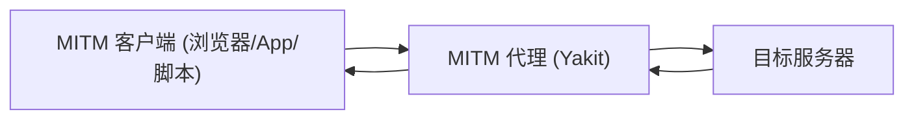

# SKILL: Yakit MITM 热加载 (Hot Patch)

> AI LOAD INSTRUCTION: 这是 Yaklang 三层热加载体系中的"模块级 MITM"专题。MITM 热加载允许安全测试人员在不中断代理服务的情况下，用 Yaklang 代码动态接管 HTTP 流量的各个处理阶段。先读本页的 Hook 触发时机表与 forward/drop 语义，再看 `examples/` 下按 Hook 命名的示例，每个示例都可用 `yak <file>` 直接自测。

## 0. 相关路由

- 总入口与三层体系：[yak](../yak/SKILL.md)
- Web Fuzzer 热加载（单 Tab 发包加解密/重试）：[webfuzzer-hotpatch](../webfuzzer-hotpatch/SKILL.md)
- 全局热加载（先于模块执行的全系统 hook）：[global-hotpatch](../global-hotpatch/SKILL.md)

## 1. 三个基本角色

理解 Hook 前先理解 MITM 的三方：



- 浏览器：把流量导向 Yakit 的一端（浏览器、移动 App、自动化脚本）。
- MITM 代理（Yakit）：接收请求，可改可丢，再转发给目标；拿到响应后也可再改，回写客户端。所有 Hook 都挂在代理内部。
- 目标服务器：真正的后端。

## 2. Hook 三大类与触发时机

Yakit MITM 把 Hook 分成三类：请求响应劫持类（同步串行，可改可丢）、镜像类（只观察分析）、数据包存储处理类。

| Hook | 触发时机 | 能否改写 | 提交方式 |
|---|---|---|---|
| `hijackHTTPRequest(isHttps, url, req, forward, drop)` | 浏览器发起请求后、发往目标前（最主要的请求拦截点） | 是 | `forward(req)` / `drop()` |
| `hijackHTTPResponse(isHttps, url, rsp, forward, drop)` | 收到目标响应后、回写客户端前 | 是 | `forward(rsp)` / `drop()` |
| `hijackHTTPResponseEx(isHttps, url, req, rsp, forward, drop)` | 同上，但同时拿到 req（推荐） | 是 | `forward(rsp)` / `drop()` |
| `beforeRequest(isHttps, oreq, req)` | 请求出站前最后时刻（在 hijackHTTPRequest 之后） | 是（返回值提交） | `return req` |
| `afterRequest(isHttps, oreq, req, orsp, rsp)` | 响应回写前最后时刻（在 hijack response 之后） | 是（返回值提交） | `return rsp` |
| `mirrorHTTPFlow(isHttps, url, req, rsp, body)` | 每个请求响应完成后（含全部流量） | 否，仅观察 | 无 |
| `mirrorFilteredHTTPFlow(isHttps, url, req, rsp, body)` | 仅通过过滤规则的流量 | 否，仅观察 | 无 |
| `mirrorNewWebsite(isHttps, url, req, rsp, body)` | 发现新域名（每域名一次） | 否，仅观察 | 无 |
| `mirrorNewWebsitePath(isHttps, url, req, rsp, body)` | 发现新路径（同域名同路径一次） | 否，仅观察 | 无 |
| `mirrorNewWebsitePathParams(isHttps, url, req, rsp, body)` | 发现新参数组合（结构去重） | 否，仅观察 | 无 |
| `hijackSaveHTTPFlow(flow, modify, drop)` | 入库 History 前最后一环 | 是（改 flow） | `modify(flow)` / `drop()` |
| `mockHTTPRequest(isHttps, url, req, mockResponse)` | 请求出站前，可用本地响应替代 | 是（替代响应） | `mockResponse(rspStr)` |

### forward / drop 语义（劫持类的核心）

- `forward(req|rsp)`：放行（可改写后的）数据包。劫持类 hook **必须**对每个数据包调用 forward 或 drop，否则该请求被挂起。
- `drop()`：丢弃数据包。
- 未命中目标时也要 `forward(原始包)`，保证其余流量与后续插件继续处理。

### beforeRequest / afterRequest 的特殊性

这里的 "Request" 沿用 Burp/Zap 习惯，指"浏览器发出请求 → 代理转发 → 代理拿到响应"整段往返。

- `beforeRequest`：请求出站前最后修改机会，通过 **返回值** 提交；修改对用户劫持界面不可见。
- `afterRequest`：响应回写前最后修改机会，同样通过返回值提交。

## 3. mirror 去重语义（重要）

访问以下序列时：

```text
http://a:8080/abc/        http://a:8080/abc/12      http://a:8080/abc/13
http://a:8080/abc/14      http://a:8080/abc/14?x=1  http://b:8080/abc/14
```

- `mirrorNewWebsite`：触发 2 次（域名 `a:8080`、`b:8080` 各一次）。
- `mirrorNewWebsitePath`：触发 5 次（`a:8080` 下 4 个不同路径 + `b:8080/abc/14`；带 query 的 `/abc/14?x=1` 仍是 `/abc/14` 不重复）。
- `mirrorNewWebsitePathParams`：按 query 参数 **结构** 去重（参数名相同值不同不重复触发）。

## 4. 全部 Hook 示例索引（examples/，一个函数一个示例）

表中**每一个 Hook 都有独立示例 + YAK_MAIN 自测**，`yak <file>` 即可自证，证据见 `scripts/validate-skills.yak`。

| Hook | 示例场景 | 文件 |
|---|---|---|
| `hijackHTTPRequest` | 出站前改 JSON 业务字段（金额） | [examples/hijack-request.yak](examples/hijack-request.yak) |
| `hijackHTTPResponse` | 仅凭响应补安全头 + 抹版本号 | [examples/hijack-response.yak](examples/hijack-response.yak) |
| `hijackHTTPResponseEx` | 删除阻断型 JS（alert/跳转）保留调试页面 | [examples/hijack-response-ex.yak](examples/hijack-response-ex.yak) |
| `beforeRequest` | 出站前最后注入 Trace 头（返回值提交） | [examples/before-request.yak](examples/before-request.yak) |
| `afterRequest` | 回写前打调试标记（返回值提交） | [examples/after-request.yak](examples/after-request.yak) |
| `mirrorHTTPFlow` | 全量流量被动扫描敏感信息泄露 | [examples/mirror-http-flow.yak](examples/mirror-http-flow.yak) |
| `mirrorFilteredHTTPFlow` | 仅过滤后流量按内容类型统计 | [examples/mirror-filtered-http-flow.yak](examples/mirror-filtered-http-flow.yak) |
| `mirrorNewWebsite` | 新域名发现 → 资产清单 | [examples/mirror-new-website.yak](examples/mirror-new-website.yak) |
| `mirrorNewWebsitePath` | 新路径发现与去重收集 | [examples/mirror-new-website-path.yak](examples/mirror-new-website-path.yak) |
| `mirrorNewWebsitePathParams` | 新参数组合发现 → Fuzz 选靶 | [examples/mirror-new-website-path-params.yak](examples/mirror-new-website-path-params.yak) |
| `hijackSaveHTTPFlow` | 入库前敏感词打标签 + 染色 | [examples/hijack-save-http-flow.yak](examples/hijack-save-http-flow.yak) |
| `mockHTTPRequest` | 危险操作（DELETE/PUT）mock 护栏 | [examples/mock-http-request.yak](examples/mock-http-request.yak) |

## 5. 标准写法：hook 函数 + YAK_MAIN 自测

所有 MITM 热加载脚本统一结构——注册 hook 为函数变量，再用 `if YAK_MAIN { runSelfTest() }` 守卫本地自测：

```yak
hijackHTTPRequest = func(isHttps, url, req, forward, drop) {
    // ... 命中目标则改写, 未命中也要 forward 原包
    forward(req)
}

func runSelfTest() {
    // 用自定义 forward/drop callback 捕获结果并 assert
}

if YAK_MAIN {
    runSelfTest()
}
```

`YAK_MAIN` 是引擎注入的全局布尔：

- `yak xxx.yak` 命令行运行：`YAK_MAIN = true`，跑 `runSelfTest()` 做 mock 自测。
- yakit MITM 热加载窗口加载：`YAK_MAIN = false`，自测块不执行，仅注册 hook。

因此把含自测块的完整脚本粘贴回 yakit 是绝对安全的。

### 各 Hook 的自测 mock 方式

| Hook | 自测验证方式 |
|---|---|
| `hijackHTTPRequest` / `hijackHTTPResponseEx` | 自定义 `forward`/`drop` callback，断言捕获的包内容 |
| `mirror*` | 直接调用 hook，断言外层状态（set/slice/染色字段）变更 |
| `hijackSaveHTTPFlow` | 用 `map` 模拟 `*HTTPFlow`，stub `AddTag`/颜色方法，验证 `modify(flow)` 被调用 |
| `mockHTTPRequest` | 自定义 `mockResponse` callback，验证目标触发、非目标不触发 |

## 6. 常用 API 速查

| 用途 | API |
|---|---|
| 取请求/响应 body | `poc.GetHTTPPacketBody(packet)` |
| 替换 body | `poc.ReplaceHTTPPacketBody(packet, newBody)` |
| 取/替换 header | `poc.GetHTTPPacketHeader(packet, key)` / `poc.ReplaceHTTPPacketHeader(packet, key, val)` |
| 取请求方法 | `poc.GetHTTPRequestMethod(req)` |
| 取响应状态码 | `poc.GetStatusCodeFromResponse(rsp)` |
| flow 原文 | `codec.StrconvUnquote(flow.Request)~` / `codec.StrconvQuote(str)` |
| 主动发包 | `poc.HTTP(raw, poc.https(b), poc.timeout(5), poc.save(false))~` |

## 7. 验证

```bash
cd /Users/v1ll4n/Projects/yaklang
go run common/yak/cmd/yak.go skills/mitm-hotpatch/examples/hijack-request.yak
# 或已安装引擎: yak skills/mitm-hotpatch/examples/hijack-request.yak

# 用与 Yakit gRPC 同款执行路径在真实请求上验证:
go build -o /tmp/yak ./common/yak/cmd/yak.go
printf 'POST /api/order/create HTTP/1.1\r\nHost: shop.example.com\r\nContent-Type: application/json\r\n\r\n{"amount":100}' > /tmp/req.txt
/tmp/yak hotpatch-mitm --script skills/mitm-hotpatch/examples/hijack-request.yak --request /tmp/req.txt
```

每个示例应：10 秒内完成、所有 assert 通过、log 全英文、最终出现 `... self test passed`。

## 参考来源

- yak-project-public 031 (2025-10-17) MITM 热加载全流程解析：一文拆解 Hook 函数四大实战场景
- yak-project-public 030 (2025-10-24) Yakit 热加载实战技巧
- yak-project-public 024 (2025-12-05) Mock 重塑无污染客户端测试
- 引擎实现：`common/yak/hook_mixed_plugin_caller.go`
