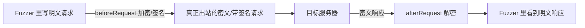

# SKILL: Yakit Web Fuzzer 热加载 (Hot Patch)

> AI LOAD INSTRUCTION: 这是三层热加载体系中的"模块级 Web Fuzzer"专题。Web Fuzzer 热加载作用于单个 Fuzzer Tab 的发包流程，最典型的用途是"内网加密对抗"（请求加密、响应解密、签名注入）与"自动化决策"（重试、业务失败判定）。先读 Hook 签名与返回值语义，再看 `example-*.yak`，每个都可 `yak <file>` 自测。

## 0. 相关路由

- 总入口与三层体系：[yak](../yak/SKILL.md)
- MITM 热加载（代理侧劫持/镜像/入库）：[mitm-hotpatch](../mitm-hotpatch/SKILL.md)
- 全局热加载（先于模块执行、MITM/Fuzzer 共享）：[global-hotpatch](../global-hotpatch/SKILL.md)

## 1. Hook 签名与返回值语义

Web Fuzzer 热加载的 hook 与 MITM 有关键区别：劫持类通过 **返回值** 提交修改（不是 forward/drop）。

| Hook | 签名 | 作用 | 提交方式 |
|---|---|---|---|
| `beforeRequest` | `(https, originReq, req) -> req` | 请求出站前改写（加密/签名/加头） | `return` 新请求 |
| `afterRequest` | `(https, originReq, req, originRsp, rsp) -> rsp` | 响应回显前改写（解密/格式化） | `return` 新响应 |
| `retryHandler` | `(https, retryCount, req, rsp, retry)` | 重试触发时决定下一步 | `retry([newReq])` |
| `customFailureChecker` | `(https, req, rsp, fail)` | 自定义"失败"判定 | `fail("原因")` |
| `mirrorHTTPFlow` | `(req, rsp, params) -> params` | 提取参数供 `{{params(name)}}` | `return` map |
| `mockHTTPRequest` | `(https, url, req, mockResponse)` | 离线/无服务时用本地响应 | `mockResponse(rspStr)` |

> 注意：Web Fuzzer 的 `mirrorHTTPFlow(req, rsp, params)` 与 MITM 的 `mirrorHTTPFlow(isHttps, url, req, rsp, body)` **签名不同**，不要混用。

## 2. 核心场景一：内网加密对抗

现代 Web 应用常对请求/响应做加密或签名。把加解密/签名逻辑沉淀到热加载，就能在 Fuzzer 里直接对 **明文** 做 fuzz，发包时自动加密、回显时自动解密。



| 场景 | Hook | 示例 |
|---|---|---|
| AES-CBC 请求加密 + 响应解密 | `beforeRequest` + `afterRequest` | [example-before-after-aes-cbc.yak](example-before-after-aes-cbc.yak) |
| timestamp+nonce+HMAC 签名注入 | `beforeRequest` | [example-sign-hmac-before-request.yak](example-sign-hmac-before-request.yak) |

国密（SM4-CBC / SM2 / SM3）同理，把 `codec.AESCBC*` 换成 `codec.SM4*` / `codec.Sm3` 即可。

## 3. 核心场景二：自动化决策（重试 / 失败判定）

文章 043 引入的两个函数把"人工分析响应再决定怎么办"自动化、代码化：

| 场景 | Hook | 示例 |
|---|---|---|
| 405→POST / 429 退避 / 401 放弃 / 5xx 重试 | `retryHandler` | [example-retry-status-aware.yak](example-retry-status-aware.yak) |
| 200 OK 但 body 含失败关键词判为失败 | `customFailureChecker` | [example-custom-failure-checker.yak](example-custom-failure-checker.yak) |

- `retryHandler` 需配合 yakit Fuzzer 的重试配置（开启重试 + 指定失败状态码）使用。
- `customFailureChecker` 解决"协议层 200、业务层失败"的爆破筛选难题。

## 4. 核心场景三：fuzztag 与关联测试

| 场景 | 机制 | 示例 |
|---|---|---|
| 动态计算哈希 payload | `{{yak(hash|md5,admin)}}` | [example-fuzztag-hash.yak](example-fuzztag-hash.yak) |
| 多步请求提取 token/csrf | `mirrorHTTPFlow` 返回 map → `{{params(name)}}` | [example-mirror-flow-extract-params.yak](example-mirror-flow-extract-params.yak) |

热加载里定义的普通函数 `f = func(param){ return [...] }` 即可作为 `{{yak(f|参数)}}` 标签被调用，返回数组的每个元素是一个 payload。

## 5. 标准写法：hook 函数 + YAK_MAIN 自测

```yak
beforeRequest = func(https, originReq, req) {
    // 改写 req
    return req
}

func runSelfTest() {
    // 构造 mock 请求, 调用 hook, assert 返回值
}

if YAK_MAIN {
    runSelfTest()
}
```

`YAK_MAIN` 区分运行环境：

- `yak xxx.yak` 命令行：`YAK_MAIN = true`，跑自测。
- yakit Fuzzer 热加载窗口：`YAK_MAIN = false`，仅注册 hook。

### 各 Hook 的自测 mock 方式

| Hook | 自测验证方式 |
|---|---|
| `beforeRequest` / `afterRequest` | 构造 mock 请求/响应，断言返回包内容（可对加密结果做反向解密验证 roundtrip） |
| `retryHandler` | 自定义 `retry` callback（`func(args...)`），断言调用次数与新请求内容 |
| `customFailureChecker` | 自定义 `fail` callback，断言是否被标记失败 |
| `mirrorHTTPFlow` | 直接调用，断言返回 map 的提取字段 |
| `mockHTTPRequest` | 自定义 `mockResponse` callback，验证目标触发 |

## 6. 常用 codec / poc API 速查

| 用途 | API |
|---|---|
| AES-CBC 加/解密 | `codec.AESCBCEncrypt(key, data, iv)~` / `codec.AESCBCDecrypt(key, cipher, iv)~` |
| Base64 编/解码 | `codec.EncodeBase64(b)` / `codec.DecodeBase64(s)~` |
| HMAC-SHA256（返回字节）| `codec.EncodeToHex(codec.HmacSha256(key, data))` |
| 哈希 | `codec.Md5(s)` / `codec.Sha256(s)` / `codec.EncodeToHex(codec.Sm3(s))` |
| 状态码 | `poc.GetStatusCodeFromResponse(rsp)` |
| 改方法 | `poc.ReplaceHTTPPacketMethod(req, "POST")` |
| 改 body / header | `poc.ReplaceHTTPPacketBody` / `poc.ReplaceHTTPPacketHeader` |
| 取请求 method/path | `poc.GetHTTPRequestMethod(req)` / `poc.GetHTTPRequestPath(req)` |

## 7. 验证

```bash
cd /Users/v1ll4n/Projects/yaklang
go run common/yak/cmd/yak.go skills/webfuzzer-hotpatch/example-before-after-aes-cbc.yak
```

每个示例应：10 秒内完成、assert 全过、log 全英文、出现 `... self test passed`。

## 参考来源

- yak-project-public 043 (2025-07-25) Web Fuzzer 新的热加载函数——重试控制与错误处理
- yak-project-public 270 (2022-07-28) 前端 AES-ECB 加密 Web 安全测试实战
- yak-project-public 282/285 (2022-05) Yakit Web Fuzzer 终极能力强化 热加载 Fuzz
- yak-project-public 167 (2023-11-17) Web Fuzzer 进阶
- 引擎实现：`common/yak/script_engine_for_fuzz.go`
