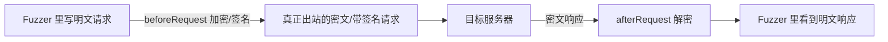
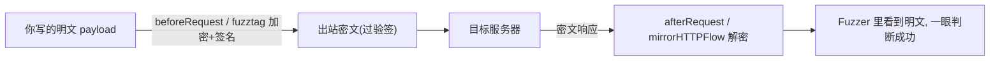

# SKILL: Yakit Web Fuzzer 热加载 (Hot Patch)

> AI LOAD INSTRUCTION: 这是三层热加载体系中的"模块级 Web Fuzzer"专题。Web Fuzzer 热加载作用于单个 Fuzzer Tab 的发包流程，最典型的用途是"内网加密对抗"（请求加密、响应解密、签名注入）与"自动化决策"（重试、业务失败判定）。先读 Hook 签名与返回值语义，再看 `examples/` 下按 Hook 命名的示例，每个都可 `yak <file>` 自测。处理"前端加密各种 HACK / 让用户看到明文"时直接看第 5 节的组合配方（`examples/combo-*.yak`）；写任何热加载前务必读第 6 节"并发与全局变量"避免竞争崩溃。

## 0. 相关路由

- 总入口与三层体系：[yak](../yak/SKILL.md)
- MITM 热加载（代理侧劫持/镜像/入库）：[mitm-hotpatch](../mitm-hotpatch/SKILL.md)
- 全局热加载（先于模块执行、MITM/Fuzzer 共享）：[global-hotpatch](../global-hotpatch/SKILL.md)

## 1. Hook 签名与返回值语义

Web Fuzzer 热加载的 hook 与 MITM 有关键区别：劫持类通过 **返回值** 提交修改（不是 forward/drop）。

| Hook | 签名 | 作用 | 提交方式 |
|---|---|---|---|
| `beforeRequest` | `(https, originReq, req) -> req` | 请求出站前改写（加密/签名/加头） | `return` 新请求 |
| `afterRequest` | `(https, originReq, req, originRsp, rsp) -> rsp` | 响应回显前改写（解密/格式化） | `return` 新响应 |
| `retryHandler` | `(https, retryCount, req, rsp, retry)` | 重试触发时决定下一步 | `retry([newReq])` |
| `customFailureChecker` | `(https, req, rsp, fail)` | 自定义"失败"判定 | `fail("原因")` |
| `mirrorHTTPFlow` | `(req, rsp, params) -> params` | 提取参数供 `{{params(name)}}` | `return` map |
| `mockHTTPRequest` | `(https, url, req, mockResponse)` | 离线/无服务时用本地响应 | `mockResponse(rspStr)` |

> 注意：Web Fuzzer 的 `mirrorHTTPFlow(req, rsp, params)` 与 MITM 的 `mirrorHTTPFlow(isHttps, url, req, rsp, body)` **签名不同**，不要混用。

## 2. 核心场景一：内网加密对抗

现代 Web 应用常对请求/响应做加密或签名。把加解密/签名逻辑沉淀到热加载，就能在 Fuzzer 里直接对 **明文** 做 fuzz，发包时自动加密、回显时自动解密。



| 场景 | Hook | 示例 |
|---|---|---|
| timestamp+nonce+HMAC 签名注入 | `beforeRequest` | [examples/before-request.yak](examples/before-request.yak) |
| AES-CBC 响应解密（Fuzzer 看明文） | `afterRequest` | [examples/after-request.yak](examples/after-request.yak) |

国密（SM4-CBC / SM2 / SM3）同理，把 `codec.AESCBC*` 换成 `codec.SM4*` / `codec.Sm3` 即可。

## 3. 核心场景二：自动化决策（重试 / 失败判定）

文章 043 引入的两个函数把"人工分析响应再决定怎么办"自动化、代码化：

| 场景 | Hook | 示例 |
|---|---|---|
| 405→POST / 429 退避 / 401 放弃 / 5xx 重试 | `retryHandler` | [examples/retry-handler.yak](examples/retry-handler.yak) |
| 200 OK 但 body 含失败关键词判为失败 | `customFailureChecker` | [examples/custom-failure-checker.yak](examples/custom-failure-checker.yak) |
| 目标未上线时用本地响应联调 | `mockHTTPRequest` | [examples/mock-http-request.yak](examples/mock-http-request.yak) |

- `retryHandler` 需配合 yakit Fuzzer 的重试配置（开启重试 + 指定失败状态码）使用。
- `customFailureChecker` 解决"协议层 200、业务层失败"的爆破筛选难题。
- `mockHTTPRequest` 让 payload 渲染/重试/失败判定在没有真实服务时也能跑通联调。

## 4. 核心场景三：fuzztag 与关联测试

| 场景 | 机制 | 示例 |
|---|---|---|
| 动态计算哈希 payload | `{{yak(hash|md5,admin)}}` | [examples/fuzztag-handle.yak](examples/fuzztag-handle.yak) |
| 多步请求提取 token/csrf | `mirrorHTTPFlow` 返回 map → `{{params(name)}}` | [examples/mirror-http-flow.yak](examples/mirror-http-flow.yak) |

热加载里定义的普通函数 `f = func(param){ return [...] }` 即可作为 `{{yak(f|参数)}}` 标签被调用，返回数组的每个元素是一个 payload。

## 5. 前端加密对抗组合配方（让用户看到明文）

单个 hook 解决单点问题，真实"前端加密 HACK"往往要 **多个 hook 组合**：发包侧加密/签名，回包侧解密，让你在 Fuzzer 里始终面对 **明文**。这正是绕过前端加密做爆破/测试的核心套路。



| 组合配方 | 涉及 hook | 对抗的前端防护 | 示例 |
|---|---|---|---|
| AES-CBC 写明文/看明文往返 | `beforeRequest` + `afterRequest` | CryptoJS AES-CBC 静态密钥 | [examples/combo-aescbc-plaintext-roundtrip.yak](examples/combo-aescbc-plaintext-roundtrip.yak) |
| 加密 + HMAC 验签 双重防护 | `beforeRequest` + `afterRequest` | AES 加密叠加签名防篡改 | [examples/combo-sign-and-encrypt.yak](examples/combo-sign-and-encrypt.yak) |
| RSA-OAEP + AES-GCM 混合加密 | `{{yak(...)}}` fuzztag + `mirrorHTTPFlow` | 动态公钥 + 非对称包裹对称密钥 | [examples/combo-rsa-aesgcm-hybrid.yak](examples/combo-rsa-aesgcm-hybrid.yak) |

要点：
- **请求侧**用 `beforeRequest`（整包加密/签名）或 `{{yak(fn|...)}}` fuzztag（只加密某个字段）。
- **响应侧**用 `afterRequest`（直接把响应改成明文回显）或 `mirrorHTTPFlow`（把解密结果提取成变量，配合序列 `{{params(name)}}`，并在结果表里一眼看出成功）。
- 动态密钥/公钥用 **Web Fuzzer 序列**：Step0 取密钥 → 数据提取器存 `publicKey`/`privateKey` → Step1 `{{params(publicKey)}}` 引用（见混合加密示例头注释）。
- 常用算法 API：`codec.AESCBCEncryptWithPKCS7Padding` / `codec.AESGCMEncryptWithNonceSize12` / `codec.RSAEncryptWithOAEP` / `codec.HmacSha256`，国密换成 `codec.Sm4*` / `codec.SM2*`。

> 关于"明文密码传输"为什么值得测：参见文章 183——前端加密只是抬高门槛，密码本质仍在通信中可还原；把链路解密成明文后，常规注入/爆破/逻辑测试就全部恢复可用。

## 6. 并发与全局变量：尽量用"只读常量"，否则会崩

**这是热加载最容易踩的崩溃坑。** MITM / Web Fuzzer 会 **并发** 地对多个请求调用同一个 hook（同一份脚本实例）。如果你的 hook 去 **读写同一个顶层可变全局变量**（例如 `append` 到全局 slice、给全局 map 赋值、累加全局计数器），多个 goroutine 同时写就会触发 **data race**，轻则结果错乱，重则直接 panic 崩溃。

规则：

- **配置/密钥/IV/规则表等放顶层，但当作"只读常量"**：加载时赋值一次，hook 内 **绝不修改**。这种用法天然并发安全（本节所有加密组合示例都是这么写的）。
- **不要在 hook 里写共享可变全局**。需要累加/收集时：
  - 优先把状态留在 **函数局部** 或通过返回值传出（`mirrorHTTPFlow` 返回 map、`afterRequest` 返回包）。
  - 确实要跨请求聚合，用并发安全容器/锁：`sync.Map`、`sync.NewMutex()` 加锁，或 yakit 的 `db.*` / `risk.*` 落库，而不是裸 `append` 全局 slice。

```yak
// 反例(并发会崩): 多个请求同时 append 同一个全局 slice
RESULTS = []
mirrorHTTPFlow = func(req, rsp, params) { RESULTS = append(RESULTS, req); return {} }  // 危险!

// 正例: 顶层只放只读常量, 结果通过返回值带出
AES_KEY = codec.DecodeHex("3132...")~   // 只读常量, 不再修改
afterRequest = func(https, oreq, req, orsp, rsp) {
    return poc.ReplaceHTTPPacketBody(rsp, decrypt(AES_KEY, poc.GetHTTPPacketBody(rsp)))
}
```

> 本库 `mirror-*` 单 hook 示例为了"自测可断言"用了全局 slice/map 累加——那是 **单线程命令行自测** 的演示写法；放进真实并发的 MITM/Fuzzer 时，请按上面的规则改成只读常量 + 返回值/加锁。

## 7. 标准写法：hook 函数 + YAK_MAIN 自测

```yak
beforeRequest = func(https, originReq, req) {
    // 改写 req
    return req
}

func runSelfTest() {
    // 构造 mock 请求, 调用 hook, assert 返回值
}

if YAK_MAIN {
    runSelfTest()
}
```

`YAK_MAIN` 区分运行环境：

- `yak xxx.yak` 命令行：`YAK_MAIN = true`，跑自测。
- yakit Fuzzer 热加载窗口：`YAK_MAIN = false`，仅注册 hook。

### 各 Hook 的自测 mock 方式

| Hook | 自测验证方式 |
|---|---|
| `beforeRequest` / `afterRequest` | 构造 mock 请求/响应，断言返回包内容（可对加密结果做反向解密验证 roundtrip） |
| `retryHandler` | 自定义 `retry` callback（`func(args...)`），断言调用次数与新请求内容 |
| `customFailureChecker` | 自定义 `fail` callback，断言是否被标记失败 |
| `mirrorHTTPFlow` | 直接调用，断言返回 map 的提取字段 |
| `mockHTTPRequest` | 自定义 `mockResponse` callback，验证目标触发 |

## 8. 常用 codec / poc API 速查

| 用途 | API |
|---|---|
| AES-CBC 加/解密 | `codec.AESCBCEncrypt(key, data, iv)~` / `codec.AESCBCDecrypt(key, cipher, iv)~` |
| Base64 编/解码 | `codec.EncodeBase64(b)` / `codec.DecodeBase64(s)~` |
| HMAC-SHA256（返回字节）| `codec.EncodeToHex(codec.HmacSha256(key, data))` |
| 哈希 | `codec.Md5(s)` / `codec.Sha256(s)` / `codec.EncodeToHex(codec.Sm3(s))` |
| 状态码 | `poc.GetStatusCodeFromResponse(rsp)` |
| 改方法 | `poc.ReplaceHTTPPacketMethod(req, "POST")` |
| 改 body / header | `poc.ReplaceHTTPPacketBody` / `poc.ReplaceHTTPPacketHeader` |
| 取请求 method/path | `poc.GetHTTPRequestMethod(req)` / `poc.GetHTTPRequestPath(req)` |

## 9. 验证

```bash
cd /Users/v1ll4n/Projects/yaklang
go run common/yak/cmd/yak.go skills/webfuzzer-hotpatch/examples/before-request.yak

# 与 Yakit gRPC 同款执行路径 (MutateHookCaller); 验证 {{yak(...)}} fuzztag:
go build -o /tmp/yak ./common/yak/cmd/yak.go
printf 'GET / HTTP/1.1\r\nHost: t.example.com\r\n\r\n' > /tmp/req.txt
/tmp/yak hotpatch-webfuzzer --script skills/webfuzzer-hotpatch/examples/fuzztag-handle.yak \
    --request /tmp/req.txt --fuzztag '{{yak(hash|md5,hello)}}'
```

每个示例应：10 秒内完成、assert 全过、log 全英文、出现 `... self test passed`。

## 参考来源

- yak-project-public 043 (2025-07-25) Web Fuzzer 新的热加载函数——重试控制与错误处理
- yak-project-public 183 (2023-09-14) 渗透测试高级技巧 分析验签与前端加密(一)（HMAC 验签 + AES-CBC，组合配方来源）
- yak-project-public 177 (2023-10-11) 渗透测试高级技巧(二) 对抗前端动态密钥与非对称加密防护（RSA-OAEP + AES-GCM 混合，混合加密组合来源）
- yak-project-public 084 (2024-12-05) 渗透测试高级技巧(三) 被前端加密后的漏洞测试
- yak-project-public 270 (2022-07-28) 前端 AES-ECB 加密 Web 安全测试实战
- yak-project-public 282/285 (2022-05) Yakit Web Fuzzer 终极能力强化 热加载 Fuzz
- yak-project-public 167 (2023-11-17) Web Fuzzer 进阶
- 引擎实现：`common/yak/script_engine_for_fuzz.go`
