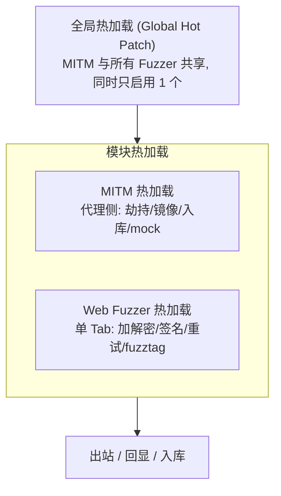

# SKILL: yak-skills 总入口

> AI LOAD INSTRUCTION: 这是 yak-skills 知识库的总路由。Yaklang 是为安全研究与渗透测试设计的 DSL（文件后缀 `.yak`），其最核心、最容易出错的机制是"热加载（Hot Patch）"。遇到 Yaklang / Yak 热加载 / Yakit 相关任务，先读本页选定专题，再按需下钻到对应 skill。所有示例都可用 `go run common/yak/cmd/yak.go <file>` 或 `yak <file>` 实测。

## 1. 路由表：什么任务进哪个 skill

| 任务信号 | 进入 skill |
|---|---|
| MITM 代理里劫持/修改请求响应、镜像分析流量、入库打标签染色、危险操作 mock | [mitm-hotpatch](../mitm-hotpatch/SKILL.md) |
| Web Fuzzer 单 Tab 发包加解密、签名注入、智能重试、业务失败判定、fuzztag、关联提参 | [webfuzzer-hotpatch](../webfuzzer-hotpatch/SKILL.md) |
| 一处配置让 MITM 与所有 Fuzzer 共享：全站透明加解密、统一签名、动态 challenge、全站染色护栏 | [global-hotpatch](../global-hotpatch/SKILL.md) |
| 写/读懂 Yaklang 语法：变量、控制流、函数、闭包、f-string、错误处理 `~` | [yaklang-syntax](../yaklang-syntax/SKILL.md) |
| 数据持久化与查询：SQLite、键值存储、Payload 字典、项目配置 | [yaklang-database](../yaklang-database/SKILL.md) |

## 2. 三层热加载体系（核心心智模型）

热加载允许在 **不中断服务** 的情况下，用 Yaklang 代码动态接管 HTTP 流量的处理阶段。它分三层，执行顺序自上而下：



| 层 | 作用范围 | 典型 Hook | skill |
|---|---|---|---|
| 全局 | 全系统所有 MITM/Fuzzer 流量，先执行 | `beforeRequest` `afterRequest` `hijackSaveHTTPFlow` | global-hotpatch |
| 模块 - MITM | 当前 MITM 任务 | `hijackHTTPRequest` `hijackHTTPResponseEx` `mirror*` `hijackSaveHTTPFlow` `mockHTTPRequest` | mitm-hotpatch |
| 模块 - Fuzzer | 当前 Fuzzer Tab | `beforeRequest` `afterRequest` `retryHandler` `customFailureChecker` `mirrorHTTPFlow` | webfuzzer-hotpatch |

> 关键区别：MITM 劫持类用 `forward(pkt)/drop()` 提交；Fuzzer 的 `beforeRequest/afterRequest` 用 **返回值** 提交。Fuzzer 的 `mirrorHTTPFlow(req, rsp, params)` 与 MITM 的 `mirrorHTTPFlow(isHttps, url, req, rsp, body)` 签名不同。

## 3. 统一写法：hook 函数 + YAK_MAIN 自测

所有热加载脚本都遵循同一个结构——把 hook 注册为函数变量，再用 `if YAK_MAIN { runSelfTest() }` 守卫本地自测：

```yak
// 1) 注册 hook (yakit 加载时只做这件事)
hijackHTTPRequest = func(isHttps, url, req, forward, drop) {
    forward(req)
}

// 2) 本地自测 (命令行运行时才跑)
func runSelfTest() {
    // 用 mock 数据 + 自定义 callback + assert 验证 hook 行为
}

if YAK_MAIN {
    runSelfTest()
}
```

`YAK_MAIN` 是 yaklang 引擎注入的全局布尔变量：

- `yak xxx.yak` / `go run common/yak/cmd/yak.go xxx.yak` 命令行运行：`YAK_MAIN = true` → 跑 `runSelfTest()`。
- yakit MITM / Fuzzer / 全局热加载窗口加载：`YAK_MAIN = false` → 只注册 hook，自测块不执行。

因此：**把含自测块的完整脚本粘贴回 yakit 是绝对安全的**——yakit 不会跑你的 mock 数据。这就是"先在命令行一键自测，再粘回 yakit 使用"的安全调试闭环。

## 4. 测试约定

```bash
# 推荐: 用 yaklang 源码引擎跑 (拿到最新能力)
cd /Users/v1ll4n/Projects/yaklang
go run common/yak/cmd/yak.go <path-to>.yak

# 或用已安装的引擎
yak <path-to>.yak
```

合格标准：脚本 10 秒内完成、所有 `assert` 通过、`log` 输出全英文、末尾出现 `... self test passed`。

## 5. 工程化原则（贡献本库时遵循）

- 注释可用中文，但 `log` 输出、字符串内容、payload 全部用英文。
- 错误处理优先用 `~` 波浪号；关键结果用 `assert` 验证。
- 在关键代码位置加 `// 关键词: ...` 注释，便于 grep 与 AI 检索。
- 不使用 emoji，只用 ASCII、中文与必要标点。
- 以认真查阅为荣，以暗猜接口为耻；不确定就 `desc(obj)` 或直接 `go run` 试。

## 参考来源

本库内容蒸馏自 Yak Project 公众号文章（`yak-project-public`）与 yaklang.github.io 官方文档，所有 Hook 签名以 yaklang 源码 (`common/yak/hook_mixed_plugin_caller.go`、`common/yak/script_engine_for_fuzz.go`) 为准。
